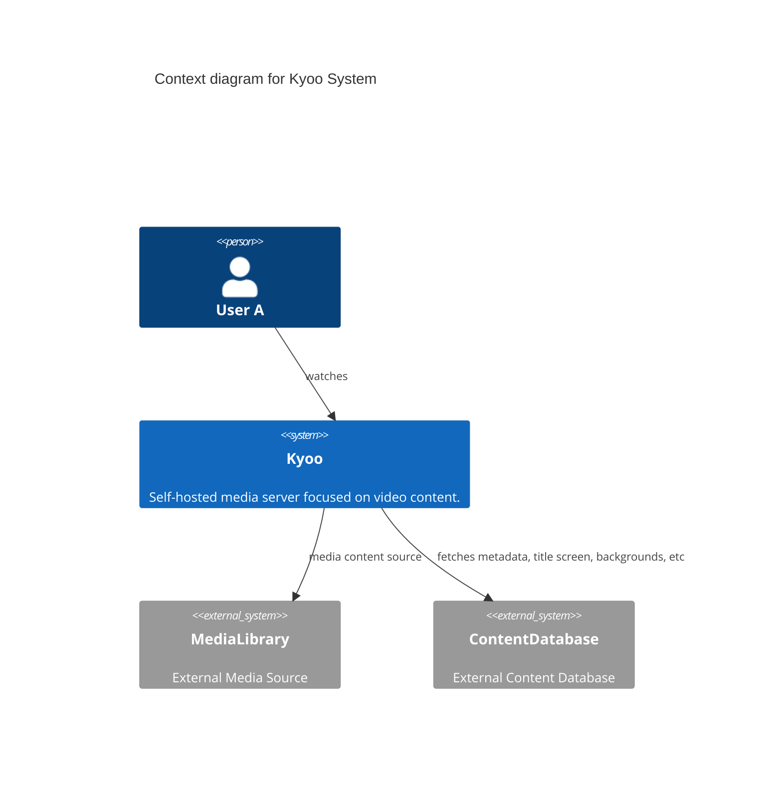
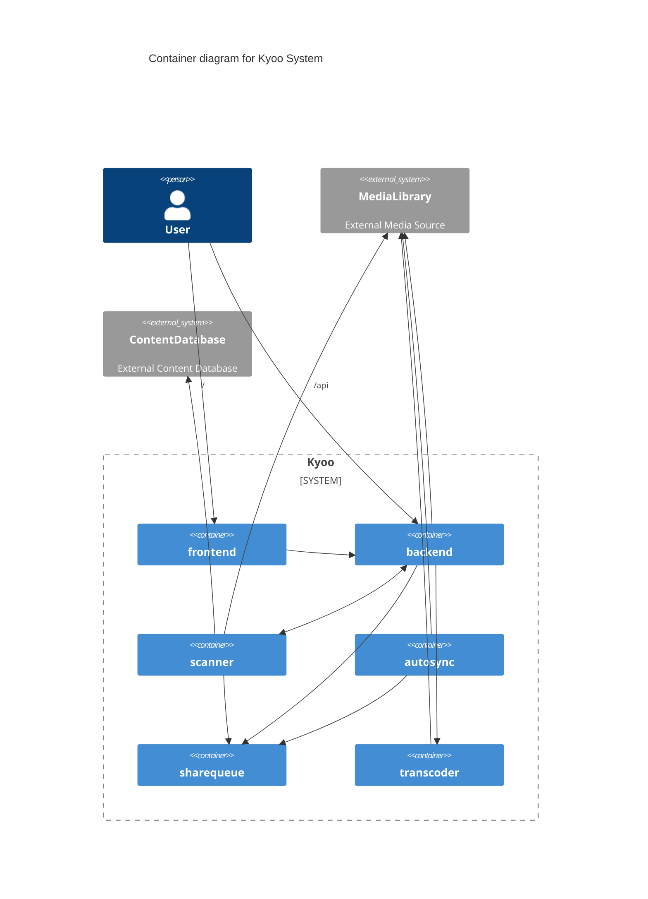
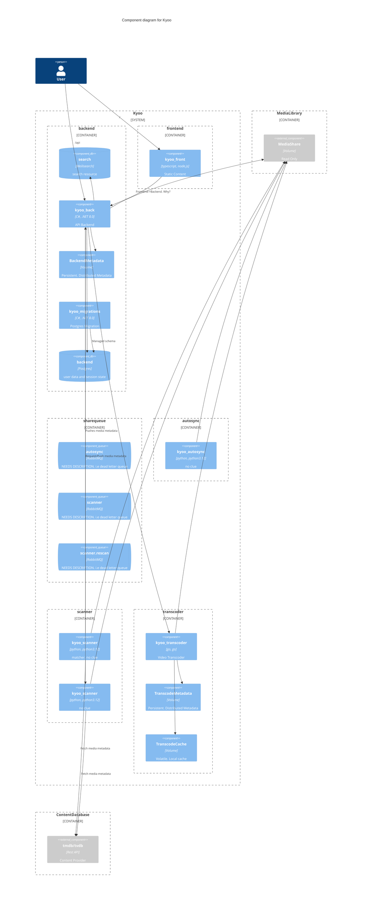

# C4 Diagrams
C4 stands for Context, Container, Component, Code.  

# Context

```mermaid
    C4Context

      title Context diagram for Kyoo System
      Person(userA, "User A")

      System(systemA, "Kyoo", "Self-hosted media server focused on video content.")
      System_Ext(systemC, "MediaLibrary", "External Media Source")
      System_Ext(systemB, "ContentDatabase", "External Content Database")


      Rel(userA, systemA, "watches")

      Rel(systemA, systemB, "fetches metadata, title screen, backgrounds, etc")
      Rel(systemA, systemC, "media content source")

      UpdateLayoutConfig($c4ShapeInRow="2", $c4BoundaryInRow="1")
```
# Container

```mermaid
    C4Container

      title Container diagram for Kyoo System
      Person(user, "User")

      System_Boundary(s1, "Kyoo") {
        Container(frontend, "frontend")
        Container(backend, "backend")
        Container(scanner, "scanner")
        Container(autosync, "autosync")
        Container(shareq, "sharequeue")
        Container(transcoder, "transcoder")
      }

      System_Ext(media, "MediaLibrary", "External Media Source")
      System_Ext(content, "ContentDatabase", "External Content Database")

      Rel(user, frontend, "/")
      Rel(user, backend, "/api")
      Rel(frontend, backend, "")
      Rel(backend, shareq, "")
      Rel(backend, media, "")
      Rel(backend, transcoder, "")
      Rel(autosync, shareq, "")
      Rel(autosync, media, "")
      Rel(scanner, shareq, "")
      Rel(scanner, media, "")
      Rel(scanner, content, "")
      Rel(transcoder, media, "")

      BiRel(backend, scanner, "")

      UpdateLayoutConfig($c4ShapeInRow="3", $c4BoundaryInRow="1")

```

# Component
Ideally this would be per component drill down, instead of global

```mermaid
    C4Component

      title Component diagram for Kyoo
      UpdateLayoutConfig($c4ShapeInRow="4", $c4BoundaryInRow="2")

      Person(user, "User")

      System_Boundary(s1, "Kyoo") {

        Container_Boundary(backend, "backend") {
          ComponentDb(backend_db2, "search", "Meilisearch", "search resource")
          Component(backend_c2, "kyoo_back", "C#, .NET 8.0", "API Backend")
          Component(backend_c3, "BackendMetadata", "Volume", "Persistent. Distributed Metadata")
          Component(backend_c1, "kyoo_migrations", "C#, .NET 8.0", "Postgres Migration")
          ComponentDb(backend_db1, "backend", "Postgres", "user data and session state")
        }

        Container_Boundary(frontend, "frontend") {
          Component(frontend_c1, "kyoo_front", "typescript, node.js", "Static Content")
        }

        Container_Boundary(shareq, "sharequeue") {
        ComponentQueue(shareq_q1, "autosync", "RabbitMQ", "NEEDS DESCRIPTION.  i.e dead letter queue")
        ComponentQueue(shareq_q2, "scanner", "RabbitMQ", "NEEDS DESCRIPTION.  i.e dead letter queue")
        ComponentQueue(shareq_q3, "scanner.rescan", "RabbitMQ", "NEEDS DESCRIPTION.  i.e dead letter queue")
        }

        Container_Boundary(autosync, "autosync") {
          Component(autosync_c1, "kyoo_autosync", "python, python3.12", "no clue")
        }

        Container_Boundary(scanner, "scanner") {
          Component(scanner_c2, "kyoo_scanner", "python, python3.12", "matcher. no clue")
          Component(scanner_c1, "kyoo_scanner", "python, python3.12", "no clue")
        }

        Container_Boundary(transcoder, "transcoder") {
          Component(transcoder_c1, "kyoo_transcoder", "go, go", "Video Transcoder")
          Component(transcoder_c2, "TranscodeMetadata", "Volume", "Persistent. Distributed Metadata")
          Component(transcoder_c3, "TranscodeCache", "Volume", "Volatile. Local cache")
        }


      }
  
  Container_Boundary(media, "MediaLibrary") {
    Component_Ext(media_c1, "MediaShare", "Volume", "Read Only")
  }

  Container_Boundary(content, "ContentDatabase") {
    Component_Ext(content_c1, "tmdb/tvdb", "Rest API", "Content Provider")
  }

  Rel(user, frontend_c1, "/")
  Rel(user, backend_c2, "/api")

  Rel(backend_c1, backend_db1, "Managed schema")
  Rel(backend_c2, backend_db1, "")
  Rel(backend_c2, backend_db2, "")
  Rel(backend_c2, backend_c3, "")
  Rel(backend_c2, media_c1, "")
  Rel(backend_c2, transcoder_c1, "")

  Rel(autosync_c1, media_c1, "")

  Rel(frontend_c1, backend_c2, "Frontend->Backend.  Why?")

  Rel(scanner_c1, content_c1, "Fetch media metadata")
  Rel(scanner_c2, content_c1, "Fetch media metadata")
  Rel(scanner_c2, backend_c2, "Pushes media metadata")
  Rel(scanner_c1, media_c1, "")
  Rel(scanner_c2, media_c1, "")

  Rel(transcoder_c1, media_c1, "")
  Rel(transcoder_c1, transcoder_c2, "")
  Rel(transcoder_c1, transcoder_c3, "")

  BiRel(backend_c2, scanner_c1, "Request/Push media metadata")

```
