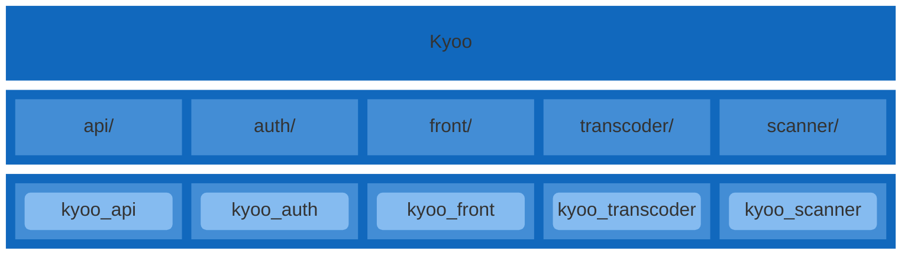
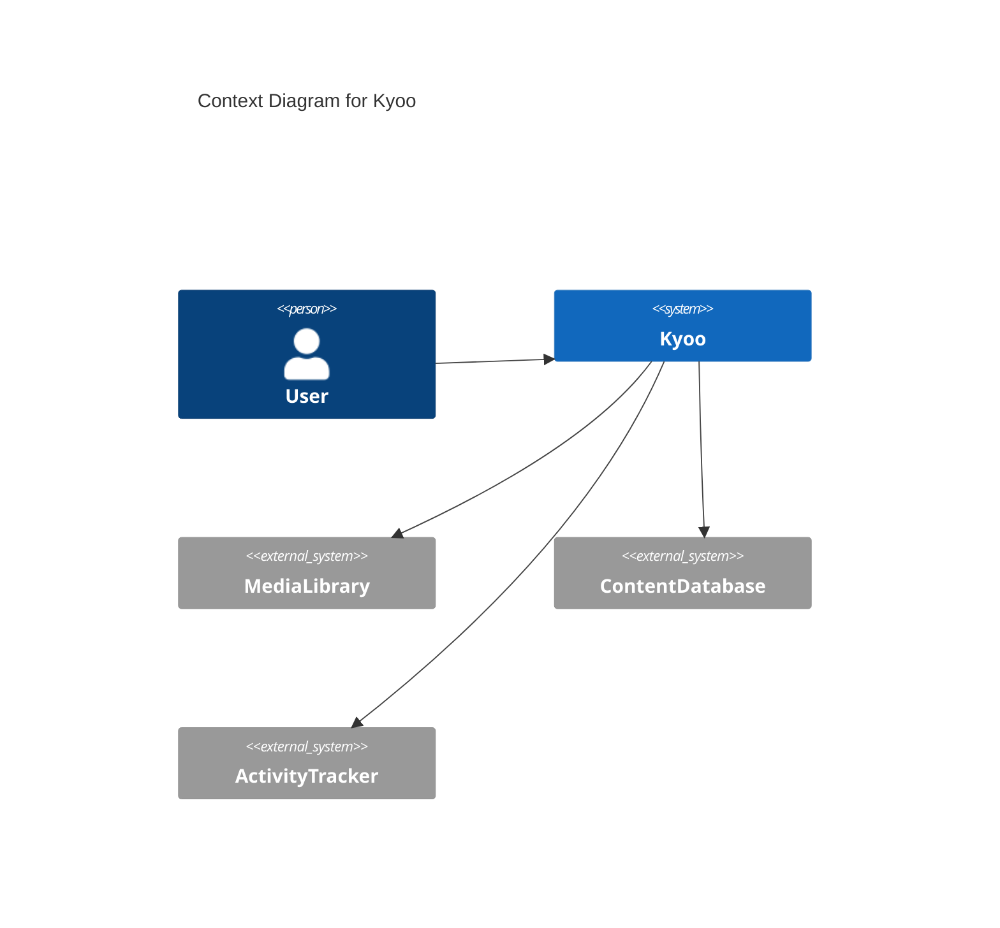
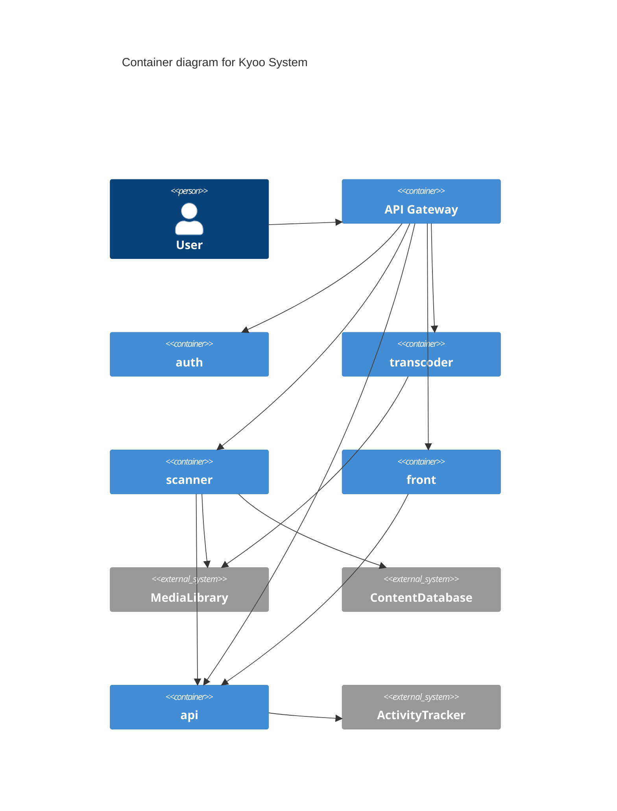
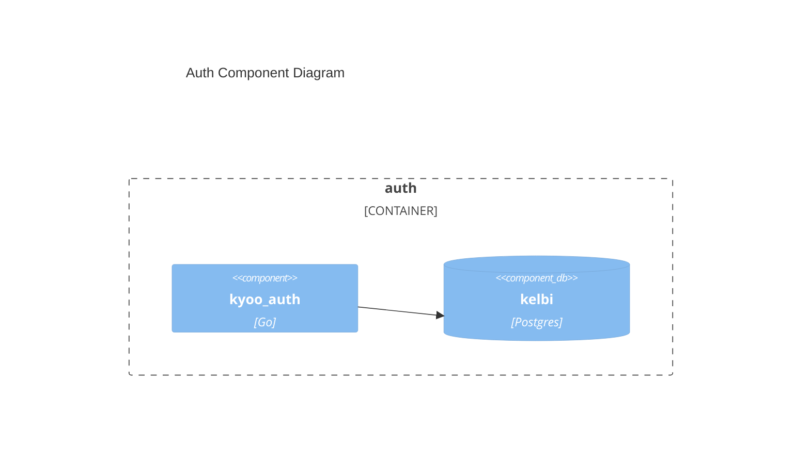
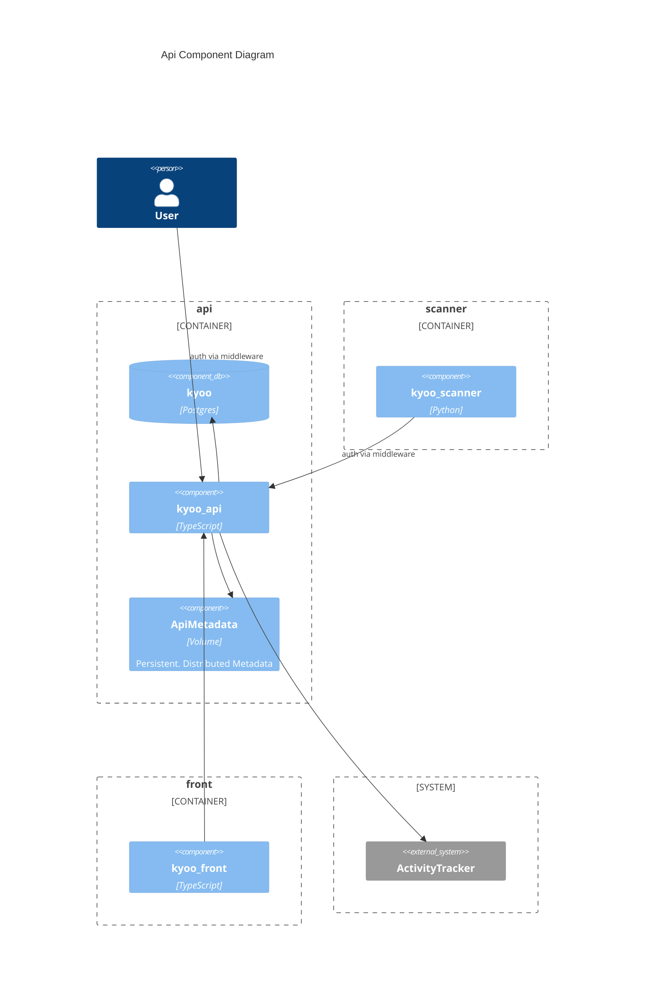
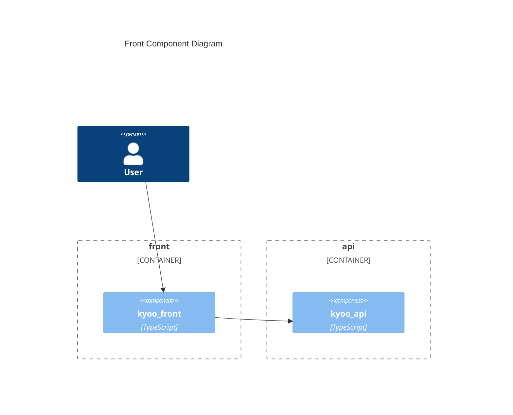
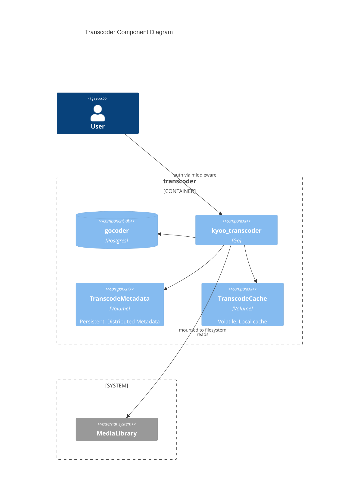
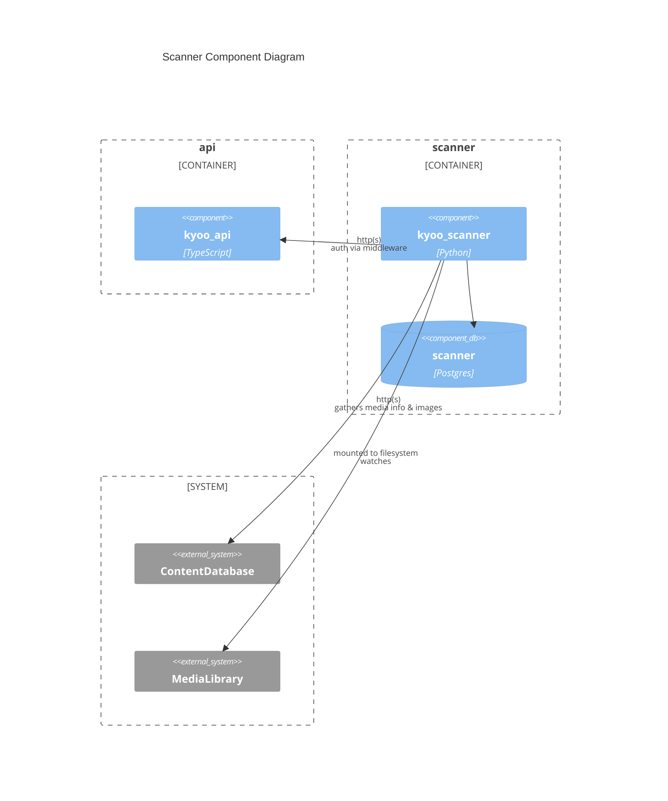

# Diagrams
These diagrams are created with Mermaid and rendered locally.  For the best experience, please use a browser.

# Project Structure
Kyoo is a monorepo that consists of several projects each in their own directory.  Diagram below shows an outline of kyoo, projects, and artifacts.

# C4 Diagrams
Diagrams that focus on capturing project from a high level point of view. Context, Container, Component, Code

## Context

## Container
Messaging is middleware.  EnterpriseMessageBus is for any messaging handled between different projects.

## Component
#### Auth
Kyoo leverages the [API Gateway](https://learn.microsoft.com/en-us/azure/architecture/microservices/design/gateway) approach to microservices and [offloads](https://learn.microsoft.com/en-us/azure/architecture/patterns/gateway-offloading) authentication at the gateway.  Auth microservice is implicitly used by each other microservice for both end user authentication and microservice to microservice communications.  

*Auth microservice will not be directly represented in the other component diagrams.  Instead in their relationsihp, they will specify "auth via middleware".

#### Api

#### Front

#### Transcoder

#### Scanner
