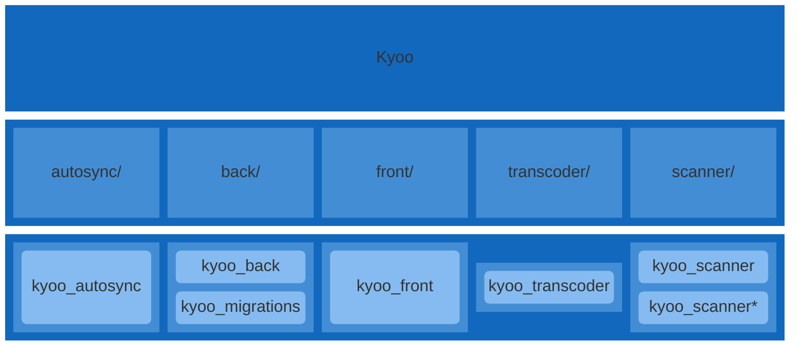
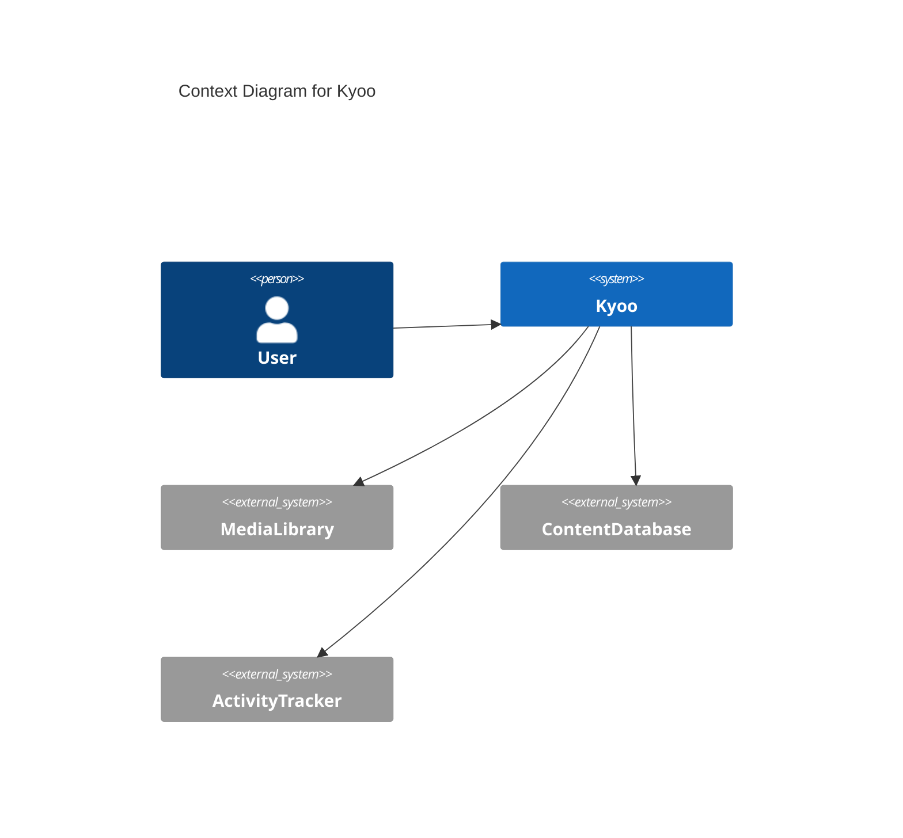
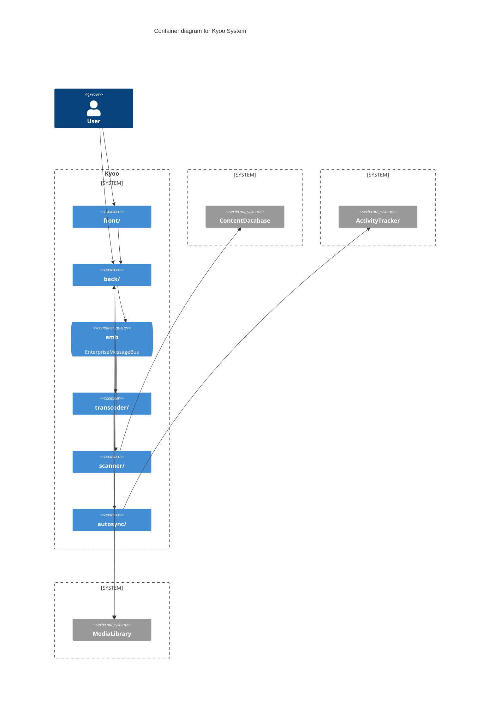
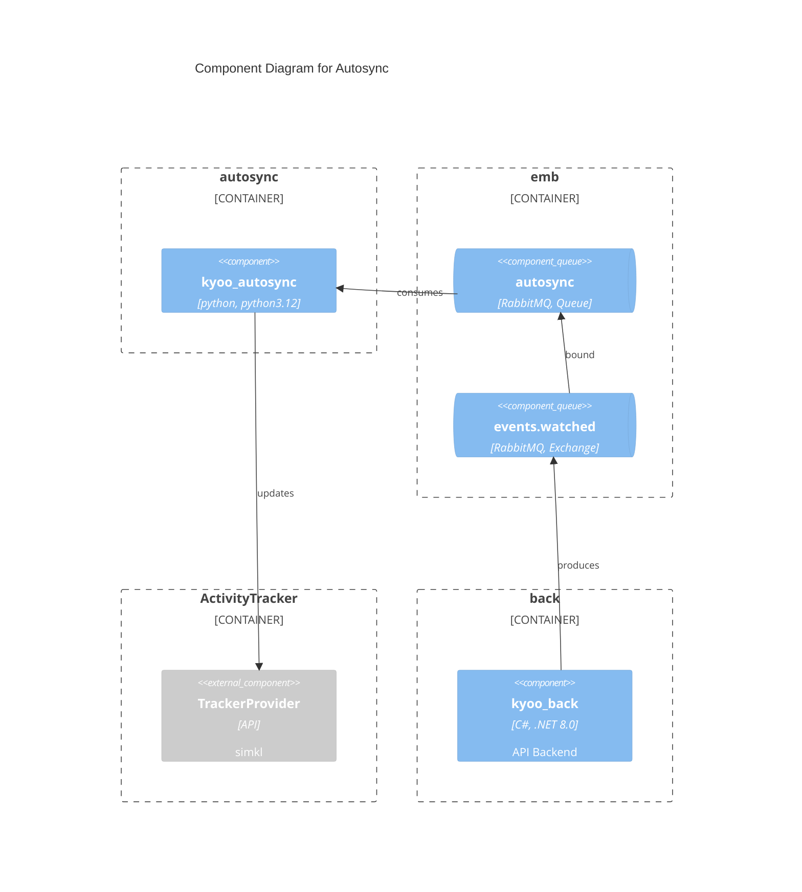
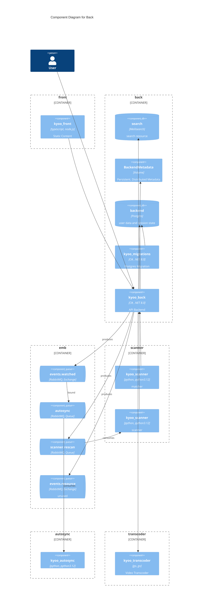
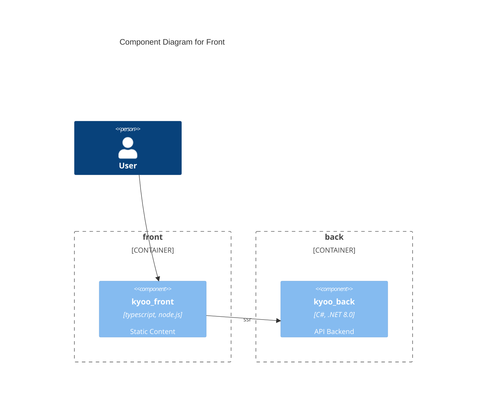
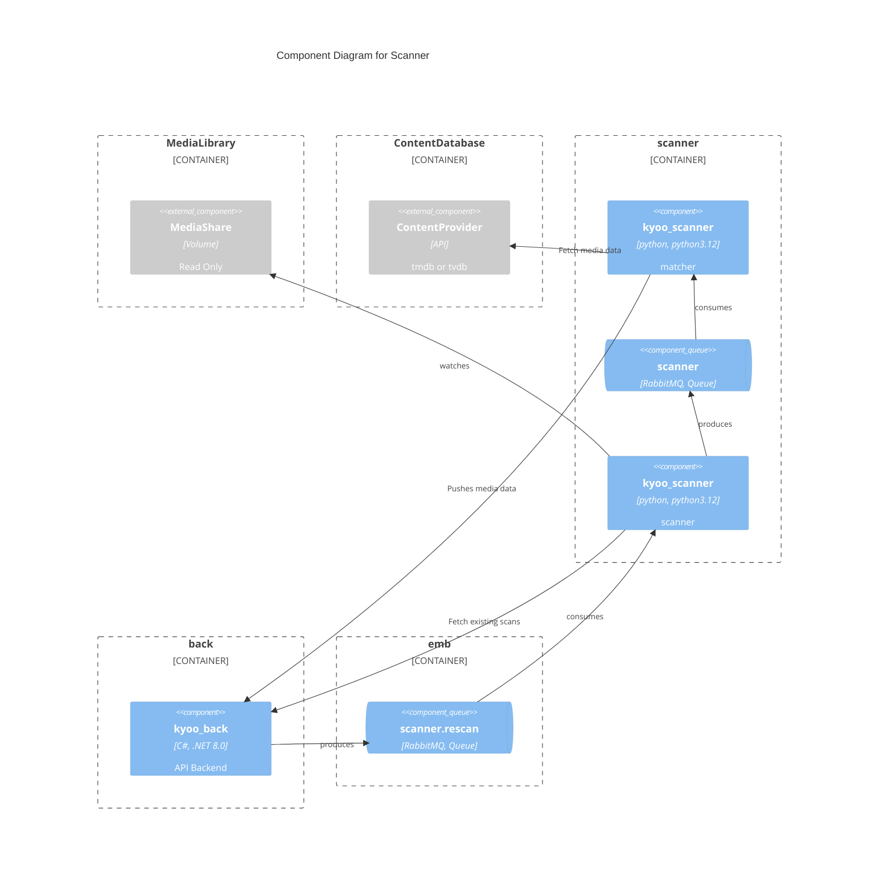
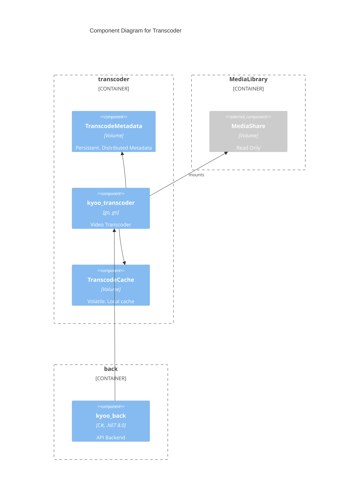

# Diagrams
These diagrams are created with Mermaid and rendered locally.  For the best experience, please use a browser.

# Project Structure
Kyoo is a monorepo that consists of several projects each in their own directory.  Diagram below shows an outline of kyoo, projects, and artifacts.

# C4 Diagrams
Diagrams that focus on capturing project from a high level point of view. Context, Container, Component, Code

## Context

## Container
Messaging is middleware.  EnterpriseMessageBus is for any messaging handled between different projects.

## Component
### Autosync

### Back

### Front

### Scanner

### Transcoder
