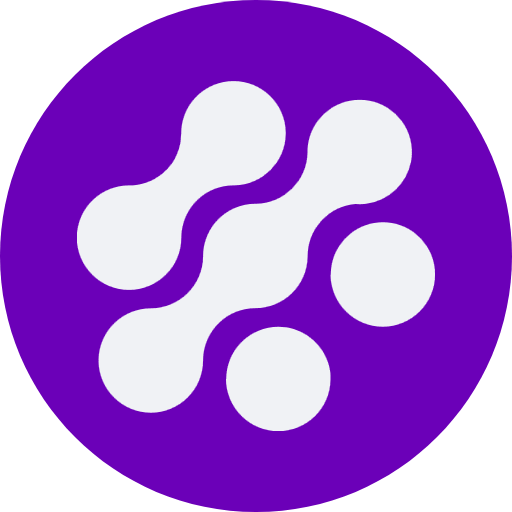

#  Kyoo

Kyoo is a self-hosted media server focused on video content (Movies, Series & Anime). It is an alternative to Jellyfin or Plex.

It aims to have a low amount of maintenance needed (no folder structure required nor manual metadata edits). Media not being scanned correctly (even with weird names) is considered a bug.

Kyoo does not have a plugin system and aim to have every features built-in (see [#Features](#-features) for the list).

## Getting Started

- **[Installation](./INSTALLING.md):** Basic installation guidelines, how to start Kyoo, enable OIDC or hardware transcoding.
- **[Join the discord](https://discord.gg/E6Apw3aFaA):** Ask questions, talk about the development, feature you might want or bugs you might encounter.
- **[API Documentation](https://kyoo.zoriya.dev/swagger):** The API to integrate Kyoo with other services, if you have any questions, please ask on GitHub or Discord!
- **[Contributing](./CONTRIBUTING.md):** Feel free to open issues, submit pull requests, and contribute to making Kyoo even better. We need you!

## Features

- **Dynamic Transcoding:** Transcode to any quality, support ABR (automatic quality switching based on network), even with original quality.

- **No folder structure**: Kyoo is there to help you manage your medias, we do not require you to already have a well organized media library. Bad naming, everything in the same directory, weird anime names, everything works out of the box.

- **Video Preview Thumbnails:** Simply hover the video's progress bar and see a preview of the video.

- **Vlc backed player**: On android (and android tv soon), we use VLC to support as many codecs as possible (you can use exoplayer if you want to too).

- **Intro/Credit detection:** Automatically detect intro/credits with audio fingerprinting (or chapter title matching).

- **Subtitle Support:** Supports PGS/VODSUB and SSA/ASS and uses the video's embedded fonts when available. Even on web or chromecast.

- **Helm Chart:** Deploy Kyoo to your Kubernetes cluster today!  There is an official Helm chart.  Multiple replicas is a WIP!

- **OIDC Connection:** Connect using any OIDC compliant service (Google, Discord, Authelia, you name it).

- ~**Watch List Scrubbing Support:** Your watch list is automatically synced to connected services (SIMKL and soon others [#351](https://github.com/zoriya/Kyoo/issues/351), [#352](https://github.com/zoriya/Kyoo/issues/352)). No need to manually mark episodes as watched.~ (soon, not reimplemented in v5 yet)

- ~**Download and Offline Support:** Download videos to watch them without internet access, your progress will automatically be synced next time your devices goes online.~ (soon, not reimplemented in v5 yet)

## Clients

Currently supported clients:
 - [x] Web
 - [x] Android
 - [ ] Android TV (planned, hopefully soon)
 - [x] Chromecast

Kyoo is being developed by one person only, as such only a few clients are available. If you want to see more please contribute ; the front is written in react-native so maintaining more clients isn't a huge burden but adapting the code so the native experience is good still takes time.

## Translations

If Kyoo is not available on your language, you can use [weblate](https://hosted.weblate.org/engage/kyoo/) to add translations easily.

## Why another media-browser?

I started this project while Jellyfin wasn't a thing yet. At first it was my playground to try stuffs ; now it's a project i use daily and want it to be good.

Kyoo has a relatively low tech-depth (v5 rewrote most of the code) and targets servers (postgres instead of sqlite, multiple services...). Technically, the project is split into multiple services that can work separately. This can allow third party apps to use kyoo's services (for example [Meelo](https://github.com/Arthi-chaud/Meelo/) uses kyoo's transcoder) or writing integrations/scripts for kyoo is easy.

Philosophically, kyoo's goal is to be low maintenance. There is few server-wide options and no directory structure to follow ; setup should be done in 5min and you will not have to clean-up your medias. You could plug kyoo into your download directory if you wanted kyoo would work perfectly fine with that.

## Live Demo

We have a live demo at [kyoo.zoriya.dev](https://kyoo.zoriya.dev) with open source movies. Special thanks to the Blender Studio for providing open-source movies available for all.

## Screens

	

<!-- vim: set wrap: -->
