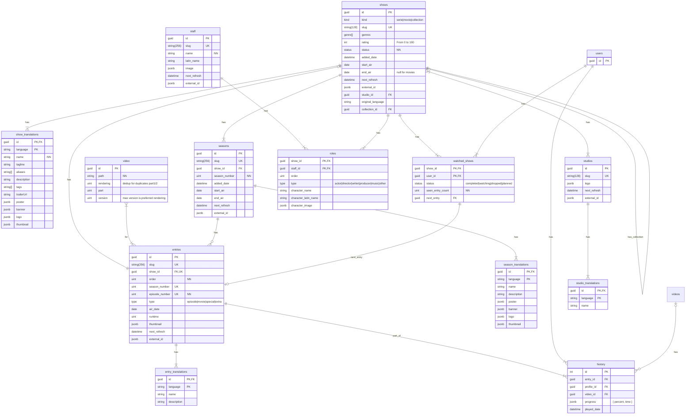

# Kyoo API

## Database schema

The many-to-many relation between entries (episodes/movies) & videos is NOT a mistake. Some video files can contain multiples episodes (like `MyShow 2&3.mvk`). One video file can also contain only a portion of an episode (like `MyShow 2 Part 1.mkv`)

