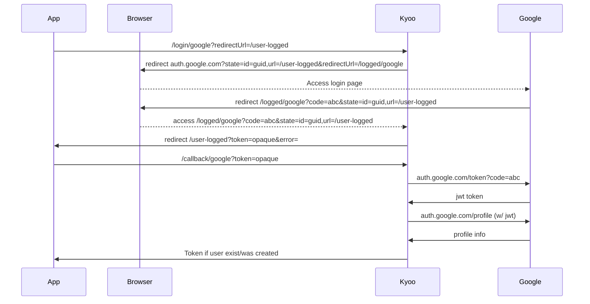
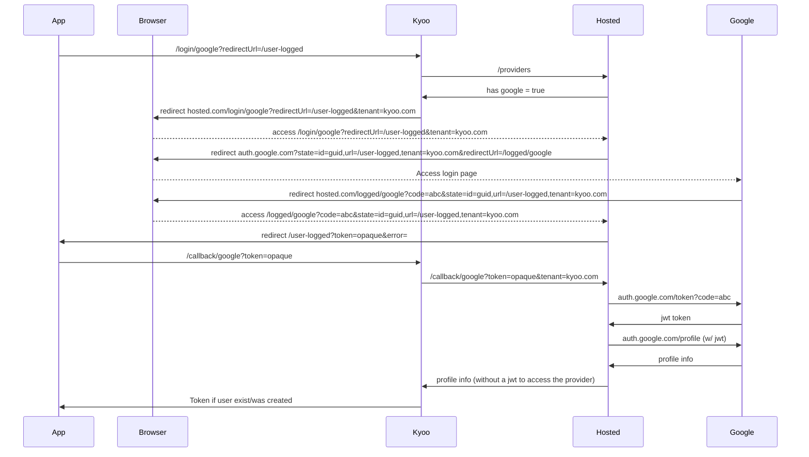

# Auth

## Features

- Not an oauth provider/no login page (as in you don't redirect to this, you create your own auth page)
- [Phantom tokens](https://curity.io/resources/learn/phantom-token-pattern/)
- Session based tokens (valid for 30 days, reset after each use [configurable])
- Last online/last connection stored per user (and token)
- Device used per session/token
- Username/password login
- OIDC (login via Google, Discord, Authentik, whatever)
- Custom jwt claims (for your role/permissions handling or something else)
- Api keys support
- Optionally [Federated](#federated)

## Routes

### Lifecycle

```
`/login` { login, password } -> token
`/login/$provider` { redirectUrl, tenant? } -> redirect
`/register` { email, username, password } -> token
`/logout` w/ optional `?session=id`
`/jwt` retrieve a jwt from an opaque token (also update last online value for session & user)
```

### Profiles

```
Get `/users` -> user[]
Get/Put/Patch/Delete `/users/$username` (or /users/me) -> user
Get/Post/Delete `/users/$username/logo` (or /users/me/logo) -> png
```

Put/Patch of a user can edit the password if the `oldPassword` value is set and valid (or the user has the `users.password` permission).\
Should require an otp from mail if no oldPassword exists (see todo).

Put/Patch can edit custom claims (roles & permissons for example) if the user has the `users.claims` permission).

Read others requires `users.read` permission.\
Write/Delete requires `users.write` permission (if it's not your account).

### Sessions

Get `/sessions` list all of your active sessions (and devices)
(can then use `/logout?session=id`)

### Api keys

```
Get `/apikeys`
Post `/apikeys` {...nlaims} Create a new api keys with given claims
```

An api key can be used like an opaque token, calling /jwt with it will return a valid jwt with the claims you specified during the post request to create it.
Creating an apikeys requires the `apikey.create` permission, reading them requires the `apikey.read` permission.

### OIDC

```
`/login/$provider` {redirectUrl, tenant?}
`/logged/$provider` {code, state, error} (callback called automatically, don't call it manually)
`/callback/$provider` {code, tenant?} (if called with the `Authorization` header, links account w/ provider else create a new account) (see diagram below)
`/unlink/$provider` Remove provider from current account
`/providers` -> provider[]
```



In the previous diagram, the code is stored by Kyoo and an opaque token is returned to the client to ensure only Kyoo's auth service can read the oauth code.

## Federated

You can use another instance to login via oidc you have not configured. This allows an user to login/create a profile without having an api key for the oidc service.
This won't allow you to retrive a provider's jwt token, you only get a profile with basic information from the provider. This can be usefull for self-hosted apps where
you don't want to setup ~10 api keys just for login.




The hosted service does not store any user data during this interaction.
A `/login` requests temporally stores an id, the tenant & the redirectUrl to unsure the profile value is not stollen. This is then deleted after a `/callback` call (or on timeout).
User profile or jwt is never stored.

## Permissions

You might have noticed that some routes requires the user to have some permissions.
Kyoo's auth uses the custom `permissions` claim for this.
Your application is free to use this or any other way of handling permissions/roles.

## TODO

- Reset/forget password
- Login via qrcode/code from other device (useful for tv for example)
- LDMA?
- Mails

