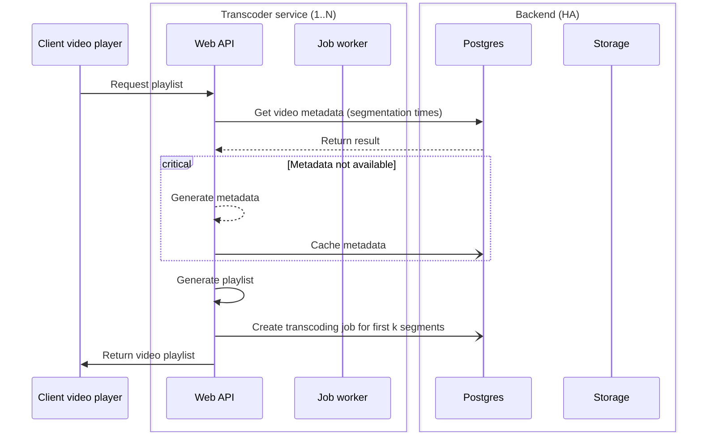
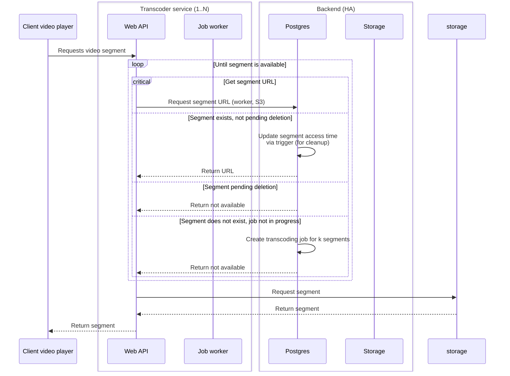
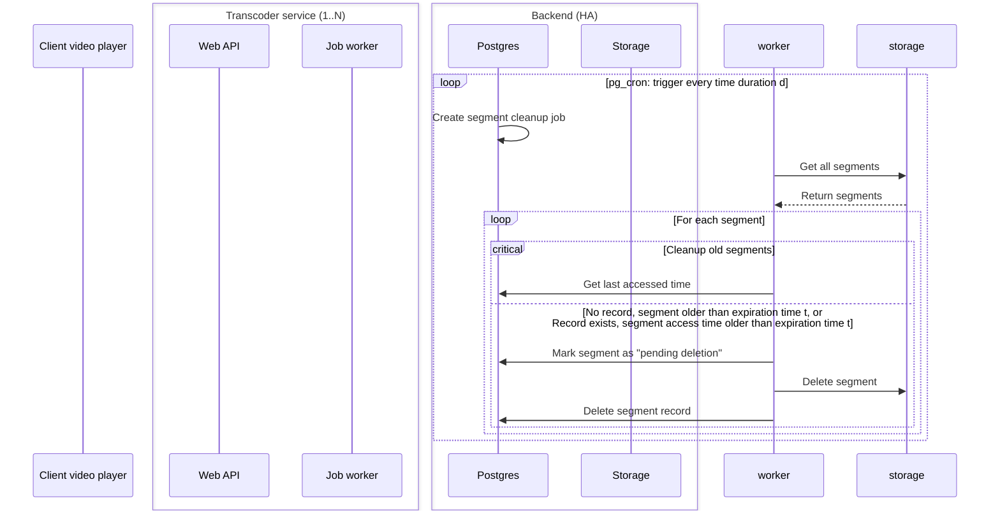
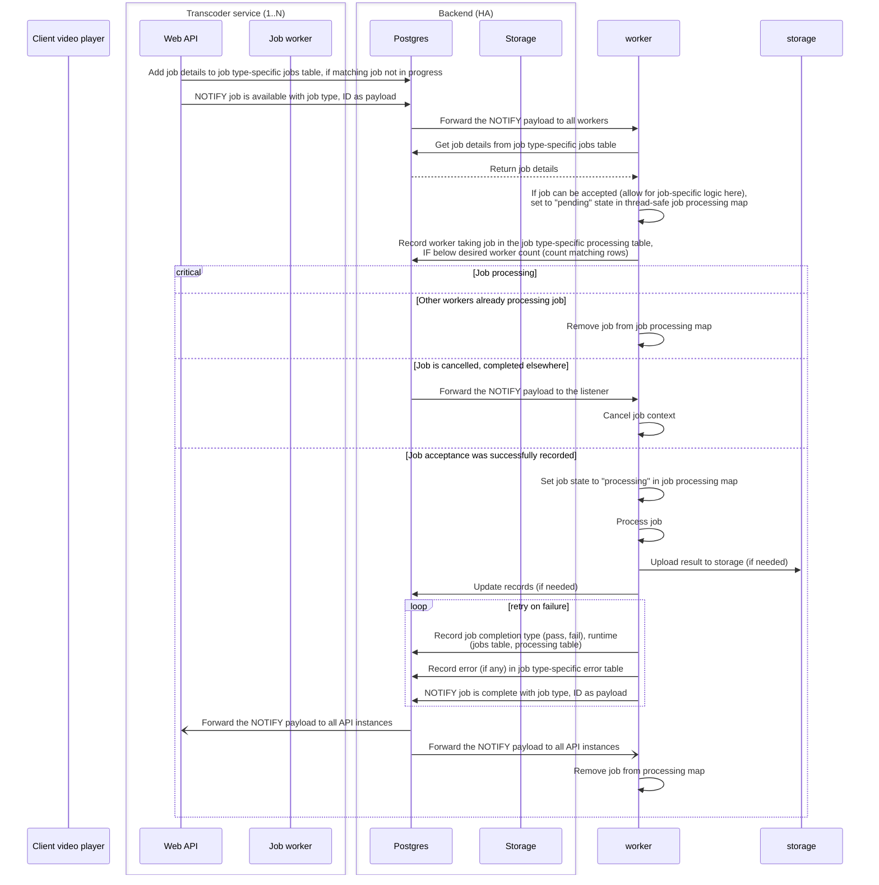
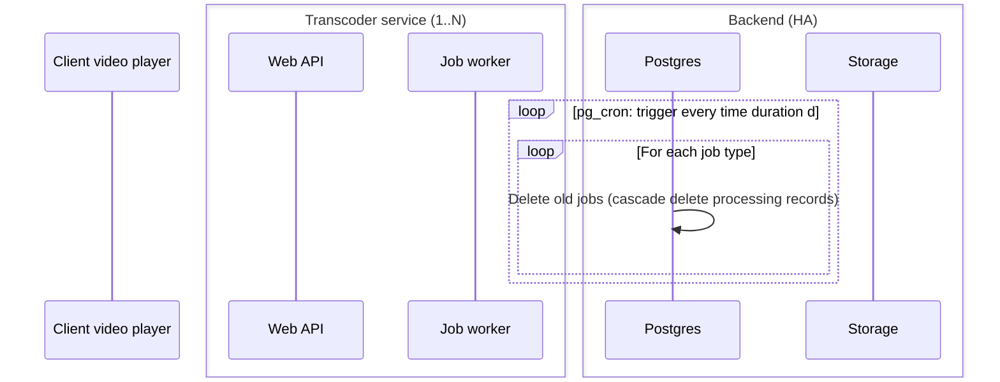
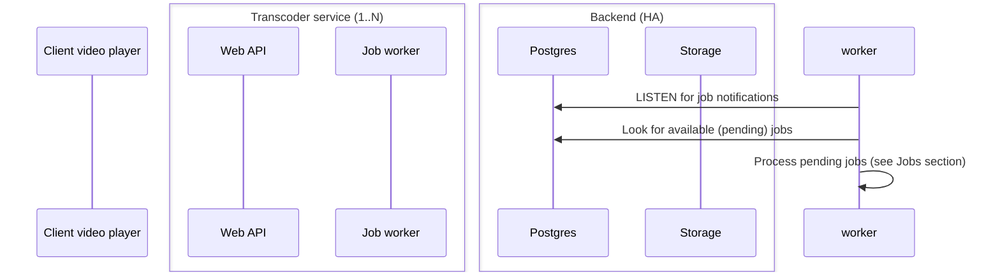

# Distributed transcoding and how playback works

Kyoo provides videos via [HTTP live streaming](https://www.cloudflare.com/learning/video/what-is-http-live-streaming/) (HLS). HLS is comprised of two components: a "playlist" (using the `.m3u8` file extension), and "transport stream segments", or "segments" (using the `.ts` file extension). Playlists contain a set of segments, which are pieces of the video being streamed. When playing a video, the client first requests a playlist of the video, and then requests segments of the video, as needed.

Segments can be generated from videos as-is (direct playback), or transcoded. Kyoo supports both options. Transcoding is on the fly, slightly ahead of when a client is expected to request segments. Transcoding may be done one segment at a time, or in batches, which generally results in better transcoding performance. Once segments are transcoded, they are cached in the storage backend (filesystem, S3) for a user-configurable duration, and eventually removed when they have not been recently accessed. Cleanup is handled as a background job, and old segments may not be removed immediately.

The transcoding service is designed to be highly available. When multiple transcoding service instances are deployed at once and configured properly, users should not notice when at least one service fails. This holds true even when the failed instance(s) were transcoding a video being actively played. This is because Kyoo supports _distributed, parallel transcoding_. The service can be configured so that a minimum number of transcoder instances will transcode the parts of the same video. When multiple instances transcode the same parts of the same video at the same time, only one has to succeed for each segments for transcoding to be successful.

Because no two segments are guaranteed to come from the same transcoder instance, it is critical that all segments are entirely independent of each other, and do not overlap. "Parallel segments", or segments covering the same video and same time range that are produced by different instances, must always start with a [I-frame](https://en.wikipedia.org/wiki/Video_compression_picture_types). The start-finish time interval of parallel segments must also match up exactly, with no extra (or missing) frames. Additionally, for interoperability with direct playback, segments must line up exactly with keyframes in the source video. See [here](https://zoriya.dev/blogs/transcoder/) for more information.

## Playback

### Playlist requests

### Segment requests

### Segment cleanup

### Job creation and processing

### Job tracker cleanup

### Worker startup

